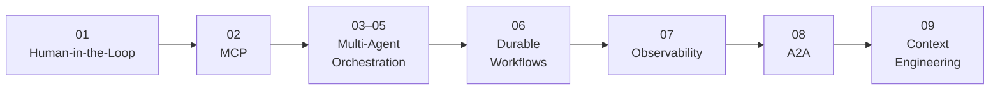

# Building AI Agents with .NET

## Part 2: Advanced Agentic Architecture and Production Workflows

Build advanced, production-oriented AI agent systems with **C#, .NET, Microsoft Agent Framework, and Azure OpenAI**.

This repository is the official companion code for **Building AI Agents with .NET — Part 2** and contains complete implementations for advanced agentic architecture patterns including:

- Human-in-the-loop workflows
- Model Context Protocol (MCP)
- Multi-agent orchestration
- Magentic orchestration
- Durable workflows
- OpenTelemetry and observability
- Agent-to-Agent (A2A) communication
- Production-ready context engineering

📘 **Get Part 2 on Amazon:**  
https://www.amazon.com/dp/B0HJHDMCZB

## What You'll Build

Across the chapters, you'll implement and explore:

- **Human-in-the-loop approval workflows**
- **Enterprise knowledge assistants using MCP**
- **Dynamic multi-agent orchestration**
- **Magentic orchestration patterns**
- **Multi-agent coordination using Microsoft Agent Framework**
- **Durable approval workflows**
- **Workflow observability with OpenTelemetry**
- **Remote Agent-to-Agent communication**
- **Context engineering for production multi-agent systems**

Each `chapter-XX` directory is a self-contained implementation with source code, tests, and chapter-specific documentation.

## From Advanced Agents to Production Architecture



**The progression:** HITL → MCP → Multi-Agent → Durability → Observability → A2A → Context Engineering

## Chapter Map

| **Chapter** | **Topic** |
| --- | --- |
| 01 | Human-in-the-Loop Workflows with Microsoft Agent Framework |
| 02 | Enterprise Knowledge Assistant using MCP |
| 03 | Dynamic Multi-Agent Orchestration |
| 04 | Magentic Orchestration |
| 05 | Multi-Agent Orchestration Patterns with MAF |
| 06 | Durable Purchase Approval |
| 07 | OpenTelemetry for Workflows |
| 08 | Agent-to-Agent (A2A) |
| 09 | Production-Ready Context Engineering for Multi-Agent Systems |

## Prerequisites

Depending on the chapter, you may need:

- The .NET SDK version required by the selected chapter
- An Azure OpenAI resource and model deployment
- Git
- Chapter-specific infrastructure described in the corresponding README

## Configuration

Tracked configuration contains safe placeholders only.

Configure credentials using **.NET User Secrets** or environment variables rather than storing credentials in source control.

For example:

```powershell
cd chapter-01

dotnet user-secrets --project src/ClaimsReview.Api set "AzureOpenAI:Endpoint" "https://YOUR-RESOURCE.openai.azure.com/"
dotnet user-secrets --project src/ClaimsReview.Api set "AzureOpenAI:ApiKey" "YOUR-API-KEY"
dotnet user-secrets --project src/ClaimsReview.Api set "AzureOpenAI:DeploymentName" "YOUR-DEPLOYMENT-NAME"
```

> **Security:** Never commit API keys, tokens, passwords, private endpoints, local databases, exported user secrets, or `.env` files.

## Build and Test

Each chapter is independent.

Start with that chapter's README, then restore, build, and test its solution or projects.

Example:

```powershell
cd chapter-01

dotnet restore ClaimsReview.sln
dotnet build ClaimsReview.sln --no-restore
dotnet test ClaimsReview.sln --no-build
```

Some chapters require additional infrastructure:

- Chapter 06 requires a Durable Task Scheduler
- Chapter 07 expects an OTLP-compatible collector for live telemetry

Refer to the individual chapter documentation for exact setup instructions.

---

# Start with Part 1

If you're new to Microsoft Agent Framework or want to follow the series from the beginning:

## Building AI Agents with .NET — Part 1

**Microsoft Agent Framework, C#, and Production-Ready Agentic Workflows**

Part 1 covers the foundations:

- Structured outputs
- Conversations and sessions
- Persistence
- Tools
- Memory
- Context providers
- Reliable tool execution
- Agent workflows

📘 **Part 1 on Amazon:**  
https://www.amazon.com/dp/B0HFMX5V9P

💻 **Part 1 GitHub Repository:**  
https://github.com/rajshukla09/building-ai-agents-with-dotnet-part-1

---

## Repository Structure

```text
building-ai-agents-with-dotnet-part-2/
├── chapter-01/
├── chapter-02/
├── chapter-03/
├── chapter-04/
├── chapter-05/
├── chapter-06/
├── chapter-07/
├── chapter-08/
├── chapter-09/
├── .gitignore
├── LICENSE
└── README.md
```

Each chapter is intentionally self-contained so readers can explore, build, test, and modify the examples independently.

## About the Series

**Building AI Agents with .NET** is a practical series focused on designing and implementing AI agents and agentic systems using **C#, .NET, Microsoft Agent Framework, Azure OpenAI, and the Microsoft AI ecosystem**.

The emphasis is on **working implementations and explicit architectural boundaries**, rather than isolated code snippets or demo-only patterns.

## Author

**Raj Shukla**

Software Architect and Generative AI Engineer focused on .NET, Azure, AI agents, agentic workflows, and production AI systems.

**GitHub:**  
https://github.com/rajshukla09

## License

The source code in this repository is licensed under the **MIT License**.

See [LICENSE](LICENSE) for details.

The book content, text, diagrams, and other published material are separately copyrighted and are not covered by the MIT License unless explicitly stated otherwise.

## Feedback and Issues

If you find an issue in an example, documentation, or chapter implementation, please open an issue in this repository.

When reporting an issue, include the chapter number and enough information to reproduce the problem.

---

**Building AI Agents with .NET — Part 2**  
*Advanced Agentic Architecture and Production Workflows*

© 2026 Raj Shukla
