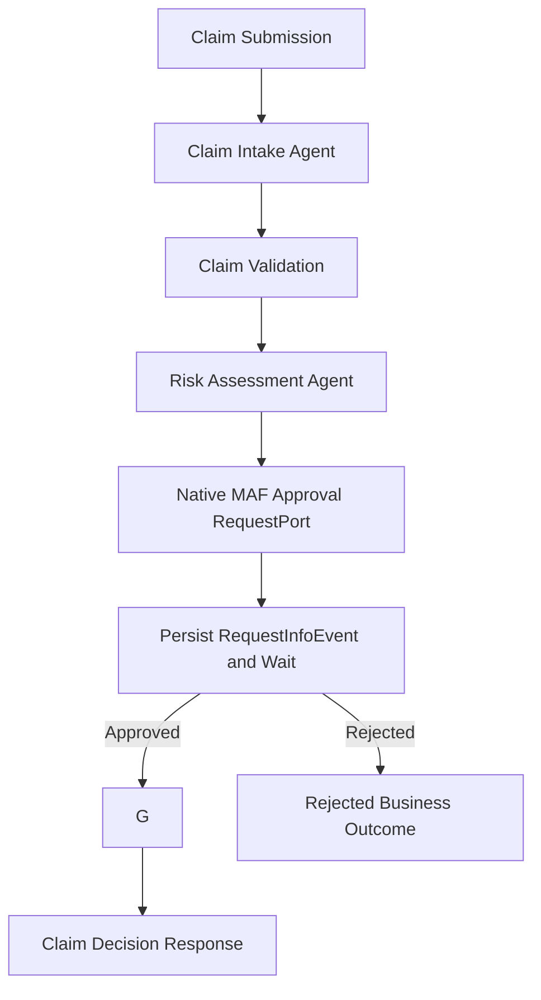
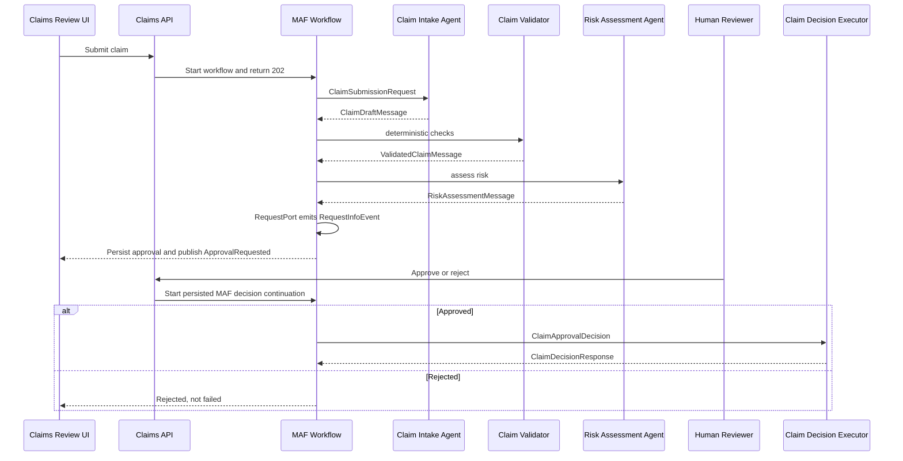

# Human-in-the-Loop Claims Workflow

Chapter 1 uses a fresh insurance claims scenario because approval is natural in claims processing: an agent can summarize and assess risk, while deterministic policy decides when a human must review.

The sample separates agent judgment from business authority. Intake and risk assessment are agents. Validation, approval policy, expiry, cancellation, rejection, and final claim decisions are deterministic application code.

The API does not keep the submit request open. Pending approvals are stored in SQLite and can be reloaded after refresh. Rejection is a valid business outcome rather than an infrastructure failure. The chapter is intentionally not Magentic orchestration: there is no supervisor, dynamic routing, fan-out/fan-in, MCP, or distributed workflow engine.
