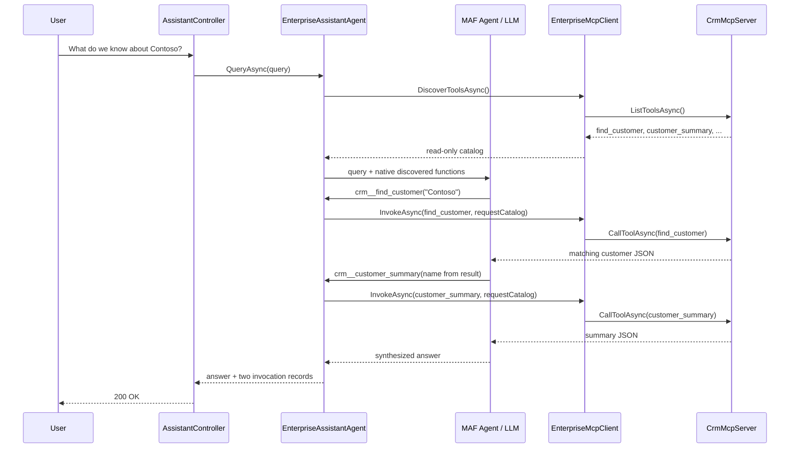
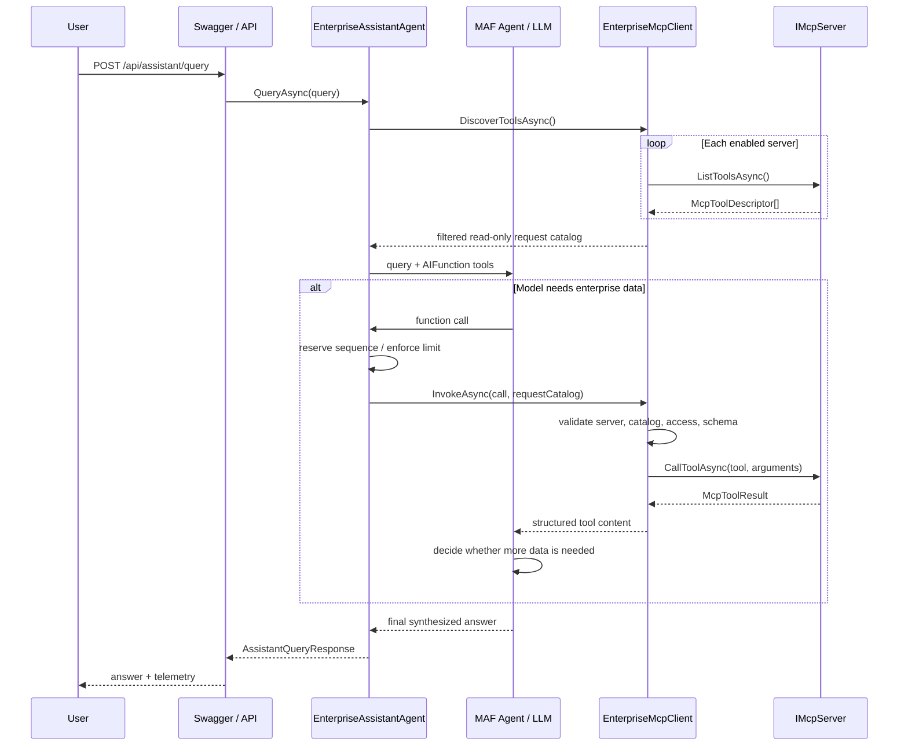

# Chapter 2 code flow: Enterprise Knowledge Assistant with MCP

## 1. Chapter goal

Chapter 2 introduces MCP from the capability consumer's point of view:

> **MCP provides a standardized mechanism through which an agent can discover and invoke capabilities exposed by external servers.**

The sample keeps four responsibilities separate:

```text
MAF Agent / LLM     decides WHAT discovered capability to use
MCP Client          discovers and INVOKES allowed capabilities
MCP Server          EXPOSES capability metadata and executes calls
Application Policy  controls what is ALLOWED and how often it may run
```

This chapter uses the official MCP SDK with a real stdio protocol boundary. `EnterpriseMcpClient` starts the same assembly with `--mcp-server`; that child process hosts `EnterpriseMcpTools` through `AddMcpServer`, `WithStdioServerTransport`, and `WithTools`. The tool bodies return deterministic sample data, so protocol interoperability must not be confused with production enterprise-system connectivity.

## 2. Architecture overview

```text
User
  │
  ▼
Swagger → POST /api/assistant/query → AssistantController.Query
  │
  ▼
EnterpriseAssistantAgent.QueryAsync
  │
  ├── EnterpriseMcpClient.DiscoverToolsAsync
  │       └── IMcpServer.ListToolsAsync on every configured server
  │
  ├── read-only catalog → request-scoped ModelTool wrappers
  │
  ▼
MafEnterpriseModelRunner.RunAsync
  │ converts ModelTool values to native AIFunction values
  ▼
MAF AIAgent / LLM reasons over the available functions
  │
  ├── final answer ───────────────────────────────────────────────┐
  │                                                              │
  └── model chooses <server>__<tool>                              │
          │                                                       │
          ▼                                                       │
      InvocationLedger.Reserve (call-limit policy)                │
          │                                                       │
          ▼                                                       │
      EnterpriseMcpClient.InvokeAsync                             │
          │ validates request catalog, access, and arguments      │
          ▼                                                       │
    ┌──────────────┬───────────┬───────────────────┬───────────┐   │
    │ GitHubMcp    │ CrmMcp    │ DocumentationMcp  │ SqlMcp    │   │
    └──────────────┴───────────┴───────────────────┴───────────┘   │
          │ structured McpToolResult                              │
          ▼                                                       │
       result returned to LLM ── another tool or final answer ────┘
          │
          ▼
AssistantQueryResponse (synthesized answer + invocation telemetry)
```

The application never maps words in the query to a server or tool. Availability comes from discovery; intent resolution belongs to the model.

## 3. Application startup

`Program.cs` performs registration, not capability discovery:

1. It binds and validates `McpOptions`, `EnterpriseKnowledgeAssistantOptions`, and `AzureOpenAIOptions`.
2. It registers `GitHubMcpServer`, `CrmMcpServer`, `DocumentationMcpServer`, and `SqlMcpServer` as singleton `IMcpServer` implementations.
3. It registers singleton `IMcpClient` → `EnterpriseMcpClient`.
4. It registers scoped `IEnterpriseModelRunner` → `MafEnterpriseModelRunner` and `IEnterpriseAssistantAgent` → `EnterpriseAssistantAgent`.
5. It adds controllers, Swagger generation, Swagger UI, and controller routes.

`appsettings.json` enables the four demo servers by name and configures `EnterpriseKnowledgeAssistant:MaxToolCalls` (five by default). `EnterpriseMcpClient` filters the injected server adapters to those enabled names when DI first constructs the client and logs the connected server names.

A subtle but important implementation detail is that **tools are not discovered and the MAF agent is not created at process startup**. `EnterpriseAssistantAgent.QueryAsync` discovers a fresh request catalog. `MafEnterpriseModelRunner.RunAsync` then creates an Azure OpenAI-backed `AIAgent` for that request, after the allowed tools are known.

## 4. HTTP entry points and Swagger

Swagger exposes three controller operations:

| Endpoint | Actual code path | Purpose |
|---|---|---|
| `POST /api/assistant/query` | `AssistantController.Query` → `IEnterpriseAssistantAgent.QueryAsync` | Run the model-directed knowledge request. |
| `GET /api/mcp/servers` | `McpController.Servers` → `IMcpClient.Servers` | Inspect enabled server descriptors. |
| `GET /api/mcp/tools` | `McpController.Tools` → `IMcpClient.DiscoverToolsAsync` | Inspect the current read-only tool catalog. |

`AssistantController.Query` rejects an empty query and otherwise returns the `AssistantQueryResponse` produced by the agent.

## 5. MCP capability discovery

`EnterpriseAssistantAgent.QueryAsync` first calls `EnterpriseMcpClient.DiscoverToolsAsync`. The client asks every enabled `IMcpServer` for `ListToolsAsync`, combines the results, removes descriptors whose `Access` is not `Read`, logs counts, and returns the allowed catalog.

The actual demo catalog contains:

```text
github/search_repositories
github/search_issues
github/search_pull_requests

crm/find_customer
crm/list_opportunities
crm/customer_summary

documentation/search_documentation
documentation/get_architecture_page
documentation/search_api_documentation

sql/execute_business_query
sql/lookup_employee
sql/lookup_project
```

Every `McpToolDescriptor` advertises its server, name, description, access classification, and an `InputSchema` collection. Each `McpToolArgument` supplies a name, JSON type, description, and required flag. The current demo functions each accept one required string named `query`.

There is deliberately no equivalent of:

```csharp
if (query.Contains("github"))
{
    CallGitHub();
}
```

The agent has no `Plan`, `Contains`, `ExtractTopic`, or `ExtractCompany` routing helper. A test enforces the absence of those former planner methods.

## 6. How discovered tools reach MAF

The conversion happens in two stages:

```text
IMcpServer.ListToolsAsync
    ↓ McpToolDescriptor
EnterpriseMcpClient.DiscoverToolsAsync
    ↓ read-only request catalog
EnterpriseAssistantAgent.CreateModelTool
    ↓ ModelTool(name, description, invocation delegate)
MafEnterpriseModelRunner.RunAsync
    ↓ AIFunctionFactory.Create
ChatClientAgentOptions.ChatOptions.Tools
    ↓
MAF AIAgent / LLM tool calling
```

`EnterpriseAssistantAgent.CreateModelTool` gives each model-visible function the unique name `<server>__<tool>`, such as `github__search_issues`. Its description is assembled from the discovered server name, tool description, and advertised input schema. Its delegate closes over the exact descriptor and the immutable catalog discovered for the request.

`MafEnterpriseModelRunner.RunAsync` converts every `ModelTool` into a native `AIFunction` with `AIFunctionFactory.Create`. Those functions are assigned to `ChatClientAgentOptions.ChatOptions.Tools`. It then creates the Azure OpenAI chat client, adapts it with `AsAIAgent`, and calls `AIAgent.RunAsync` with the unchanged user query.

This is native MAF/model tool calling. The application does not ask the model to emit a custom `{ server, tool }` routing DTO.

## 7. Who selects the tool?

The **LLM selects the tool**. `EnterpriseMcpClient` does not inspect the natural-language request and does not infer intent.

For example, for `What do we know about Contoso?`, the model can see descriptions for functions such as:

```text
github__search_issues
crm__find_customer
crm__customer_summary
documentation__search_documentation
sql__lookup_project
```

The model may choose `crm__find_customer` because its advertised description says that it finds a customer by name—not because application code detects `Contoso` or `CRM`. Once selected, the function wrapper translates that model call into a validated `McpToolCall` for `crm/find_customer`.

`EnterpriseAgentInstructions.SystemPrompt` reinforces the boundary: use advertised descriptions and schemas, permit multiple calls, use intermediate results, do not invent enterprise data, and synthesize a concise answer.

## 8. Deterministic validation and policy

A model decision is a request, not authorization. Two deterministic layers run before server execution.

### Call-count policy

`InvocationLedger.Reserve` atomically reserves a sequence number before each invocation. It rejects a call when the configured `MaxToolCalls` has already been reserved. The default is five and configuration validation permits values from 1 through 20. The lock also prevents parallel model calls from racing past the limit.

If the model requests another function after the limit, `McpToolCallLimitException` stops it. `EnterpriseAssistantAgent.QueryAsync` returns a bounded explanation and sets `ToolCallLimitReached`.

### MCP call validation

`EnterpriseMcpClient.InvokeAsync` verifies only checks implemented by the sample:

1. the requested server is connected;
2. the server/tool pair occurs in the request's discovered catalog;
3. the descriptor is classified `Read`;
4. every required argument is present;
5. each supplied value matches the advertised JSON type (`string`, `integer`, `number`, `boolean`, `object`, or `array`); and
6. no undeclared argument is present.

A rejected call never reaches `IMcpServer.CallToolAsync`. Write descriptors are filtered during discovery and denied again during invocation. Logs identify server/tool and outcome but intentionally omit argument values and returned enterprise payloads.

## 9. One MCP invocation, end to end

For a model-selected issue search, the actual path is:

```text
LLM selects github__search_issues(query: "Authentication")
  ↓
ModelTool delegate created by EnterpriseAssistantAgent.CreateModelTool
  ↓ InvocationLedger.Reserve → sequence 1
McpToolCall("github", "search_issues", { query: "Authentication" })
  ↓
EnterpriseMcpClient.InvokeAsync(call, requestCatalog)
  ↓ server/catalog/access/schema validation
GitHubMcpServer.CallToolAsync("search_issues", arguments)
  ↓ searches the in-memory Issues data
McpToolResult containing structured JSON
  ↓ raw structured content returned as tool context
MAF returns tool result to the LLM
  ↓
LLM chooses another function or writes the final prose answer
```

The `finally` block records duration and success/failure in the request ledger even if server execution throws.

## 10. The model/tool loop

MAF manages the iterative conversation:

```text
LLM
  ↓ tool call
ModelTool → validated MCP invocation
  ↓ tool result
LLM
  ↓ need more information?
  ├── yes → select another currently available tool
  └── no  → synthesize the final answer
```

The application does not plan all calls in advance. An intermediate result can supply the argument for the next call. The request ledger bounds this loop with `MaxToolCalls`, while MAF owns the tool-call/result conversation itself.

## 11. GitHub example: no server name in the request

Prompt:

```text
What open authentication problems are currently being tracked?
```

The prompt does not contain the word **GitHub**. In a live configured model run, the LLM can select `github__search_issues` from its discovered description, invoke it with an authentication search, receive the mock issue records, and synthesize a readable answer.

The deterministic test uses the closely matching prompt `What open authentication problems are being tracked?` and a scripted model double to select the same discovered function without relying on a live service. It verifies synthesized prose and telemetry equivalent to:

```text
sequence: 1
server: github
tool: search_issues
succeeded: true
```

No transient duration is asserted.

## 12. CRM example: sequential model-directed calls

Prompt:

```text
What do we know about Contoso?
```

The multi-step behavior is:

```text
LLM → crm__find_customer(query: "Contoso")
LLM ← matching customer result
LLM → crm__customer_summary(query derived from that result)
LLM ← relationship summary
LLM → final human-readable answer
```

The user did not name CRM or prescribe either operation. Both decisions are made through the model-tool interface. The deterministic test models this exact result-driven sequence: its model double reads the customer name from the first structured result before issuing the second call. It verifies both invocation records, increasing sequence numbers, and a synthesized answer.



## 13. Complete discovery and invocation sequence



## 14. Invocation telemetry and answer synthesis

`AssistantQueryResponse` separates the answer from execution metadata:

* `Answer` is the LLM's human-readable synthesis.
* `Invocations` contains one `ToolInvocationResponse` per completed call.
* `ToolCallLimitReached` tells the caller that policy stopped an additional request.

Each invocation records `Sequence`, `Server`, `Tool`, `DurationMilliseconds`, and `Succeeded`. This supports debugging, evaluation, production diagnostics, latency analysis, and explaining agent behavior without making raw tool JSON the user experience.

Tool execution and synthesis are intentionally separate:

```text
MCP server → structured enterprise data → LLM context → human-readable answer
```

The function delegate returns `McpToolResult.Content.GetRawText()` to MAF as tool context. `MafEnterpriseModelRunner` returns only the final `AgentResponse.Text` as the primary answer.

## 15. Demo boundary and mock data

All four `IMcpServer` implementations are **in-process demo adapters with small in-memory datasets**. They do not connect to production GitHub, CRM, documentation, or SQL systems, and they are not wire-compatible MCP server processes.

### GitHub MCP

`GitHubMcpServer` exposes `search_repositories`, `search_issues`, and `search_pull_requests`. Its mock data covers `KnowledgeAssistant`, `TravelPlanner`, and `ClaimsReview`, including authentication-related issues.

### CRM MCP

`CrmMcpServer` exposes `find_customer`, `list_opportunities`, and `customer_summary`. Its mock customers are Contoso, Fabrikam, Northwind, and Adventure Works.

### Documentation MCP

`DocumentationMcpServer` exposes `search_documentation`, `get_architecture_page`, and `search_api_documentation`. Its mock pages include Azure OpenAI setup, deployment, security, architecture, and a Contoso proposal.

### SQL MCP

`SqlMcpServer` exposes `execute_business_query`, `lookup_employee`, and `lookup_project`. `execute_business_query` returns a fixed demo aggregate; it does **not** execute the supplied text as SQL. The server represents allow-listed read-only business access.

The deterministic tool bodies keep the example reproducible while the client/server process and MCP stdio transport remain real. Production use would replace the sample tool bodies and add authentication, authorization, operational hardening, and real enterprise integrations.

## 16. MCP versus normal tool registration

Without MCP-style discovery, an application commonly owns and registers each integration directly:

```text
Application
  ├── register SearchIssues()
  ├── register CustomerSummary()
  └── register SearchDocumentation()
```

In this sample's MCP-shaped boundary:

```text
MCP capability providers advertise descriptors
  ↓
EnterpriseMcpClient discovers and filters them
  ↓
EnterpriseAssistantAgent creates request-scoped model tools
  ↓
MAF Agent receives the current catalog
```

MCP does not eliminate integration code. A provider still implements authentication, schemas, error handling, and the underlying operation. MCP standardizes the boundary so consumers can discover and invoke capabilities without compiling every provider's business implementation into the agent.

## 17. MCP versus a MAF workflow

MCP and MAF workflows solve different problems:

```text
MAF Workflow = orchestration and explicit control flow
MCP          = capability discovery and invocation
```

They can be combined later:

```text
MAF Workflow / Supervisor
          ↓
        Agent
          ↓
         MCP
          ↓
External Capability
```

Chapter 4 can use that composition for dynamic multi-agent orchestration. MCP does not itself provide workflow state, branching policy, checkpoints, or supervision.

## 18. What Chapter 2 does not yet cover

Chapter 2 intentionally defers:

* authentication, authorization, and per-user catalog filtering in depth;
* network-hosted MCP deployment and production transport lifecycle;
* retries, timeouts, circuit breakers, and other production resilience;
* dynamic supervisor and multi-agent orchestration; and
* richer dynamic JSON schemas—the demo wrapper currently exposes one required string `query` per tool.

The current integration uses the official MCP SDK for a wire-compatible child-process server over stdio. Discovered MCP Tools are adapted to model-callable functions for the MAF Agent. The remaining teaching seam is the deterministic sample data inside each tool body, not the MCP protocol boundary.
