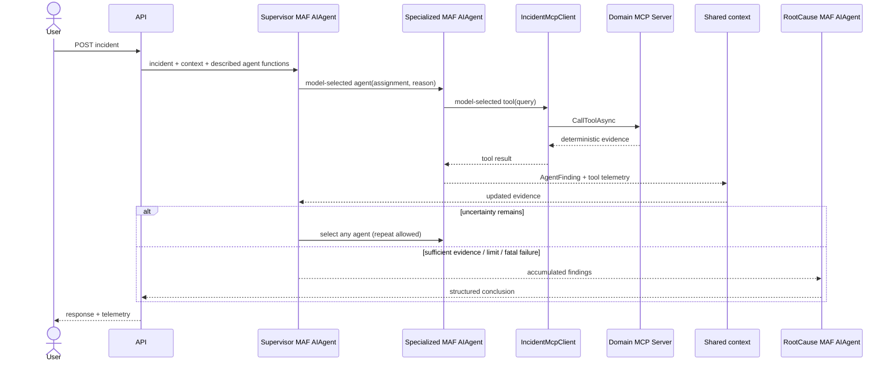

# Code flow — dynamic multi-agent incident investigation

## Learning architecture

```text
                              MAF SupervisorAgent
                                      │
                                chooses agent
                                      │
             ┌────────────────────────┼───────────────────────┐
             ▼                        ▼                       ▼
      DeploymentAgent          LogAnalysisAgent         MetricsAgent          DatabaseAgent
             │                        │                       │                     │
             ▼                        ▼                       ▼                     ▼
         MCP Client               MCP Client              MCP Client            MCP Client
             │                        │                       │                     │
             ▼                        ▼                       ▼                     ▼
   Deployment MCP Server        Logs MCP Server       Metrics MCP Server    Database MCP Server
             │                        │                       │                     │
             ▼                        ▼                       ▼                     ▼
           Tools                    Tools                   Tools                 Tools
```

**Supervisor chooses WHO investigates. Specialized Agent chooses WHAT capability it needs. MCP Client discovers/invokes. MCP Server exposes and executes capabilities.** `RootCauseAgent` is a separate tool-free MAF agent that synthesizes the accumulated findings after supervision ends.

The **Blazor Orchestration Viewer** adds an observation loop without entering the control plane:

```text
Blazor UI → API → MAF orchestration → Supervisor → Agent → MCP
                                                     ↓
                                              persisted events
                                                     ↓
                                          SignalR → UI timeline
```

`MafSupervisorModel` creates a native MAF `AIAgent` with `AsAIAgent`. Each registered specialized agent is exposed to that supervisor as an `AIFunction` using `AIFunctionFactory.Create`. The descriptions in `AgentDescriptor` are the model's routing catalog. Consequently there is no incident-keyword switch, fixed workflow graph, or predetermined order. MAF's normal model tool-calling loop performs agent-to-agent delegation, including repeat calls.

Each `McpSpecializedAgent` is independently created as a native `AIAgent`. It receives `IIncidentMcpClient`, never an MCP server implementation. The client starts the API assembly in MCP-server mode for the requested domain, discovers tools over stdio, and exposes those descriptors as MAF functions. A selected call crosses the MCP client/transport/server boundary and returns a strongly typed `AgentFinding`. `RootCauseAgent` is a final, tool-free MAF Agent and cannot perform further investigation.

## Implementation inventory

| Specialized MAF agent | MCP server | Discoverable tools |
|---|---|---|
| `DeploymentAgent` | `DeploymentMcpServer` (`deployment`) | `get_recent_deployments`, `get_release_changes`, `get_deployment_status` |
| `LogAnalysisAgent` | `LogsMcpServer` (`logs`) | `search_logs`, `find_error_patterns`, `get_trace` |
| `MetricsAgent` | `MetricsMcpServer` (`metrics`) | `get_service_metrics`, `get_error_rate`, `compare_metrics` |
| `DatabaseAgent` | `DatabaseMcpServer` (`database`) | `get_db_health`, `get_slow_queries`, `get_connection_failures` |

`SupervisorAgent` and `RootCauseAgent` have no MCP catalog because their narrow responsibilities are delegation and synthesis. `IncidentMcpClient` is the explicit client layer. The four domain servers are hosted as separate MCP stdio child processes through the official MCP SDK. Their tool bodies use deterministic sample incident data; they do not connect to production deployment, logging, metrics, or database systems.

## Request path

1. `POST /api/incidents/investigate` validates the incident.
2. `IncidentInvestigator` creates a small request-scoped `IncidentInvestigationContext`.
3. The MAF supervisor sees the incident, previous structured findings, remaining suggestions, and agent catalog.
4. Its model calls whichever specialized-agent function best reduces uncertainty, supplying a focused assignment and safe, actionable selection rationale.
5. The selected MAF agent chooses zero or more advertised MCP tools. Demo results are deterministic, while selection is model-driven.
6. The orchestrator appends the finding and agent/tool telemetry to shared context. The MAF supervisor's tool loop sees the result and may select a different agent, repeat one with a materially new assignment, or stop.
7. A tool-free `RootCauseAgent` synthesizes the best evidence into summary, likely cause, confidence, and action.



## Guardrails and termination

There are two deterministic layers. `MaxAgentInvocations` limits all supervisor delegations per request; `MaxToolCallsPerAgent` limits MCP calls within each specialized invocation. Termination occurs when (1) the supervisor returns after declaring evidence sufficient, (2) the agent limit rejects the next delegation, or (3) a fatal supervisor/agent failure occurs. Cases (2) and (3) still run final synthesis over available evidence and state the termination reason. Cancellation is propagated.

Repeated agents are allowed because a later finding can justify a narrower assignment. The supervisor prompt explicitly discourages repetition without materially new evidence. Telemetry stores sequence, agent, elapsed duration, success, safe reason selected, plus per-agent tool sequence/duration/success. It never records chain-of-thought.

## Observing Dynamic Agent Orchestration

> In a deterministic workflow, the expected path is already known. In dynamic multi-agent orchestration, observability tells us what path the supervisor actually chose at runtime.

The WebAssembly viewer is intentionally a teaching/debugging surface, not an orchestration engine. Before submitting, it creates a run ID and joins that run's SignalR group. The synchronous API execution persists concise events to SQLite and publishes `InvestigationUpdated`; the viewer then reloads the authoritative run projection. There is no polling loop and refresh/restart is safe because SQLite—not browser memory or SignalR—is the source of truth.

The event hierarchy is `InvestigationRun → SupervisorDecision → Agent invocation → McpCapabilitiesDiscovered → MCP tool invocation`. The expandable agent card renders `Agent → MCP Client → named MCP Server → selected tools`, including the complete starting catalog and each model-selected capability. Events include one run ID and monotonic sequence, safe input-context summary, public selection reason, agent/tool correlation sequences, status, timestamps, durations, finding, confidence, and sanitized error summary. Zero-millisecond stopwatch readings are rendered as `<1 ms`; no delay is fabricated. No raw prompts, tool arguments, credentials, or hidden reasoning are persisted. `RootCauseGenerated` and the serialized structured response make the final result reconstructable.

`GET /api/incidents/runs` supplies recent history. `GET /api/incidents/runs/{id}` reconstructs metadata, ordered events, configured budgets, and final result. `GET /api/incidents/runs/{id}/events` supports focused diagnostics. The UI derives its routing path solely from persisted `SupervisorDecision` events, so it can display any agent order or meaningful repeat invocation.

Lightweight `System.Diagnostics.ActivitySource` spans cover the investigation, each selected agent, and each MCP call. No exporter stack is imposed: an application can subscribe to the `EnterpriseIncidentInvestigator` source with its preferred OpenTelemetry exporter. Persisted events remain the UI's authoritative data source.

## Chapter 2 vs Chapter 3

**Chapter 2:** one LLM dynamically selects MCP **tools**.

**Chapter 3:** a supervisor dynamically selects **agents**. A selected specialized agent may itself dynamically select MCP tools. Thus agent delegation and capability selection are separate model-driven layers with separate deterministic budgets.

## Dynamic examples and tests

- A deployment-onset request may select Deployment then Logs.
- SQL timeout and latency evidence may select Metrics then Database.
- An ambiguous failure may begin anywhere the model judges useful.
- Logs may be selected twice when deployment evidence makes the second search materially more focused.

Tests replace model decisions with a scripted `ISupervisorModel`, so they assert catalog registration, multiple/repeated delegation, context updates, limits, final synthesis, telemetry, MCP use, failure handling, and absence of a keyword router without requiring Azure OpenAI or asserting one valid order for ambiguous incidents.

## MAF and MCP APIs

The sample uses `AIAgent`, `AgentResponse`, `ChatClientAgentOptions`, `AsAIAgent`, `AIFunctionFactory.Create`, and `AIAgent.RunAsync`. In Microsoft Agent Framework package version `1.15.0` already used by this repository, agent-as-function delegation is the available native composition mechanism used here: the supervisor's MAF tool loop dynamically invokes specialized MAF agents. No custom routing loop is implemented.

The MCP teaching seam uses `IIncidentMcpClient` plus official `McpClient`, `StdioClientTransport`, `AddMcpServer`, `WithStdioServerTransport`, and `[McpServerTool]`. Production code still needs authenticated connections and real operational data sources. Model output is inherently nondeterministic; budgets, allow-listed agents/tools, typed findings, and scripted CI decisions provide deterministic control around it. The only deterministic routing is catalog scoping and invocation budgets: neither client nor server inspects incident text to choose an Agent or MCP Tool.
