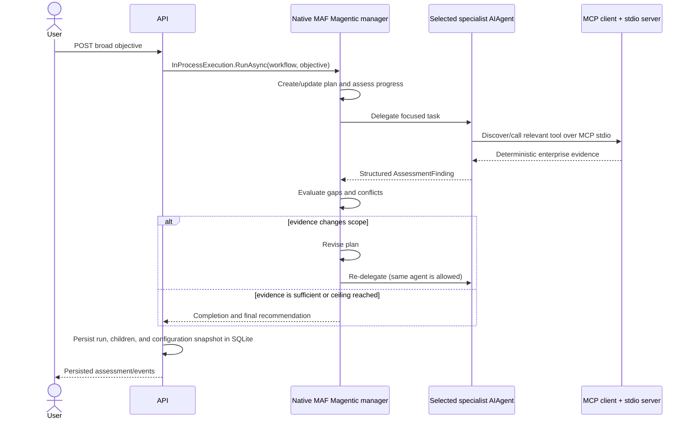
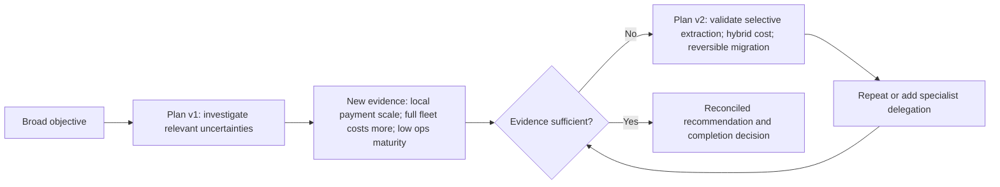

# Code flow — native Magentic assessment

```text
User → MAF Magentic Orchestration → Plan → Delegate → Agent → MCP → Finding
     → Progress Evaluation → Replan OR Complete
```

The API passes one broad objective to the native workflow. `MagenticWorkflowBuilder` receives the manager and six narrow MAF agents; it does **not** receive a predetermined sequence. `WithMaxRounds`, `WithMaxStalls`, and `WithMaxResets` bound native execution, and `InProcessExecution.RunAsync` hosts the resulting `Workflow`. Each participant chooses from only its advertised MCP functions. Observable runtime envelopes and intentional manager labels are projected into safe records and persisted through EF Core to SQLite.

```text
MAF Magentic
     ↓
Assessment runtime
     ↓
Structured observability
     ↓
EF Core
     ↓
SQLite
     ↓
History / Comparison UI
```

Magentic execution can vary between runs. Persisting plans, agent/tool activity, configuration and outcomes allows us to compare behavior rather than evaluating a single execution in isolation. Persistence observes completed runtime artifacts; it never selects participants or controls the native workflow.

## Sequence



## Plan evolution



## Observable shared view

`AssessmentView` stores the original objective, plan snapshots, delegations, structured findings, open questions, conflicts, counters, progress summary, completion reason, and recommendation. This is an intentional audit projection, not hidden chain-of-thought. The Blazor teaching viewer emphasizes v1/current plan and revisions before MCP detail.

## Chapter 3 vs Chapter 4

| Chapter 3 | Chapter 4 |
|---|---|
| Dynamic routing: **Which agent should work next?** | Magentic: **What work is required and who should do it?** |
| A supervisor chooses again after a finding. | The manager plans, evaluates what changed/remains, revises, and assesses completion. |
| Routing is the primary visible artifact. | Plan evolution, conflicts, progress, and completion are primary artifacts. |

## Exact framework API and package

The centrally pinned installed baseline is **Microsoft Agent Framework 1.15.0**. Magentic support is supplied by the official
`Microsoft.Agents.AI.Workflows` package. In this version Magentic is a factory on
`Microsoft.Agents.AI.Workflows.Specialized.MagenticWorkflowBuilder`, configured through `AddParticipants`,
`RequirePlanSignoff`, `WithMaxRounds`, `WithMaxStalls`, and `WithMaxResets` before calling `Build()`.
There is no `AgentWorkflowBuilder.BuildMagentic` method in this package version; using it caused CS0117. The earlier assumed
`MagenticBuilder` type likewise caused CS0246.
The returned `Microsoft.Agents.AI.Workflows.Workflow` runs through `InProcessExecution.RunAsync`.

MAF 1.15.0 does not publish the Magentic internal ledger, plan, progress/stall assessment, replanning decision, or completion reason as
typed result models. The manager's labeled plan/progress output is persisted only when it is observable in a native event payload; it
is produced during the native run—not by a second routing loop. Native executor envelopes back agent start/completion events. The UI
conditionally renders each projection, so an artifact that the runtime did not expose is absent rather than shown as fake empty state.
